<h1 align="center">Tahir Ali Cengiz</h1>

  <b>Cloud &amp; AI Infrastructure Architect</b> · İstanbul 
  GPU PaaS · self-hosted LLM serving · observability

  <a href="https://tr.linkedin.com/in/tahircengiz">LinkedIn</a>
  &nbsp;·&nbsp;
  <a href="https://tahircengiz.github.io/LLMScale/">LLMScale</a>
  &nbsp;·&nbsp;
  <a href="mailto:tahircengiz@gmail.com">Email</a>

---

I work on the layer between a GPU and the person asking a model a question: the
inference server, the gateway in front of it, and the dashboards that say *where*
it broke rather than just *that* it broke.

Most of what I publish starts as a real problem on hardware I own — a Ryzen AI MAX+
395 box with 96 GiB of iGPU VRAM, a Proxmox node, a rack of containers behind Traefik —
and only becomes a repo once it survives being used.

### Selected work

| | The question it answers |
|---|---|
| **[grafana-dashboards](https://github.com/tahircengiz/grafana-dashboards)** | Is the LLM gateway healthy, and if not, is the fault in the client, the gateway, or the model backend? Grafana + Prometheus boards for LiteLLM and vLLM. |
| **[LLM-Inference-Toolkit](https://github.com/tahircengiz/LLM-Inference-Toolkit)** | Is this OpenAI-compatible endpoint up, correct and fast — asked from a jump host where you cannot `pip install` anything. TTFT, p95, embedding sanity checks. |
| **[LLMScale](https://github.com/tahircengiz/LLMScale)** | How much GPU memory does a model actually need, once you account for what `params × 2` misses? Client-side, no account, no backend. [Try it](https://tahircengiz.github.io/LLMScale/). |
| **[MedAlarm](https://github.com/tahircengiz/MedAlarm)** | A medication reminder that keeps working with the network off. Android, fully offline, ad-free, free. |
| **[gestHero](https://github.com/tahircengiz/gestHero)** | Mouse gestures for Chromium browsers, with no build step to install. |
| **[youtubeQS](https://github.com/tahircengiz/youtubeQS)** | Is this video worth the click? A 0–100 score on the thumbnail, from public metrics. |

### Working with

**AI · GPU** — NVIDIA, MIG partitioning, AMD ROCm, vLLM, Ollama, LiteLLM, Open WebUI

**Cloud** — AWS, Azure, Oracle Cloud, Huawei Cloud &amp; Cloud Stack, hybrid architecture

**Platform** — Kubernetes, Docker, Proxmox VE, VMware, Veeam, Windows Server, Active Directory, Exchange

**Ops** — Prometheus, Grafana, Loki, Traefik, Tailscale, ITIL

**Elsewhere** — Home Assistant and Zigbee at home, Shapr3D and a Bambu Lab printer when the problem is physical.
